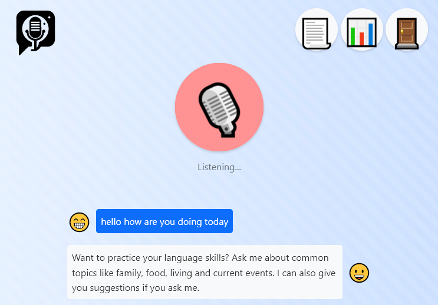
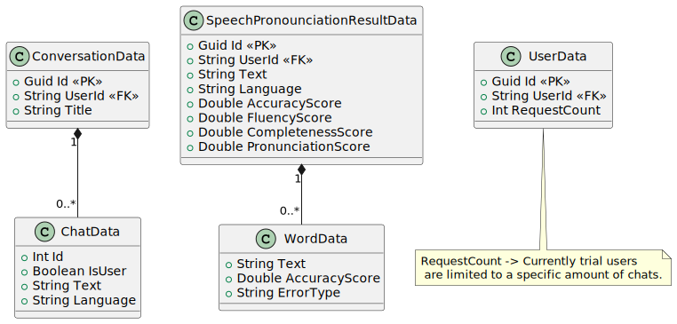
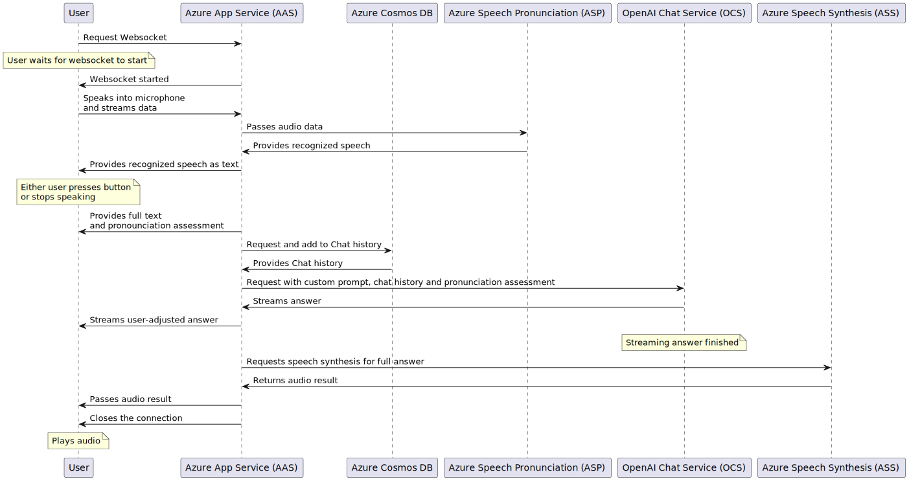

# PatterPal - Personal Language Teacher
*This project is a submission for the [Microsoft AI Classroom Hackathon](https://microsoftaiclassroom.devpost.com/).*

Immerse yourself in language learning: Talk freely on your chosen topics, get live feedback, and engage with a smart conversation partner in multiple languages. Learn your way with PatterPal!

## How it works
PatterPal is a web application that allows you to practice your speaking skills in a foreign language. *It's like having a language teacher just for yourself.*  PatterPal will listen to you and give you feedback on your pronunciation and fluency, while also talking with you about your chosen topic.

## Technologies
- Azure Speech Services
  - Speech to Text
  - Pronounciation Assessment
  - Synthesis
- Azure App Services
  - ASP.NET Core Web App
- Azure Cosmos DB
  

&nbsp;

	<code></code>
	<code></code>
	<code></code>
	<code></code>
	<code></code>
	<code></code>
	<code></code>
	<code></code>
    <code></code>

## Project Team
We are based in Austria and currently studying Software Engineering at the [University of Applied Sciences Upper Austria](https://www.fh-ooe.at/en/hagenberg-campus/).

**Members:**
- [Marcel Salvenmoser](https://github.com/malthee)
- [Stefan Weißensteiner](https://github.com/seventinnine)

## Diagrams
### Data Layer Diagram

### WebSocket Communication Workflow

## Privacy Policy

### Information Collection
- Email-Based Accounts: If you register for an account using your email, we collect and store your email address. This is used for account verification.
- Conversations and Chats: We record and store the details of your conversations and chats with PatterPal. This includes both your input and the responses from PatterPal. This is required so you can access past conversations anytime.
- Pronunciation Analysis: When speaking with PatterPal, we collect and analyze data on your pronunciation accuracy and the mistakes made during spoken text exercises. This information is used to provide personalized feedback and improve your learning experience.

### How We Use Your Information
The information we collect is used to:
- Provide, operate, and maintain our services.
- Improve, personalize, and expand our services.
- Understand and analyze how you use our services.
- Develop new products, services, features, and functionality.
- Communicate with you for service-related purposes.

You can delete your data we stored in our [Privacy Page](https://patter-pal.azurewebsites.net/Home/Privacy)
